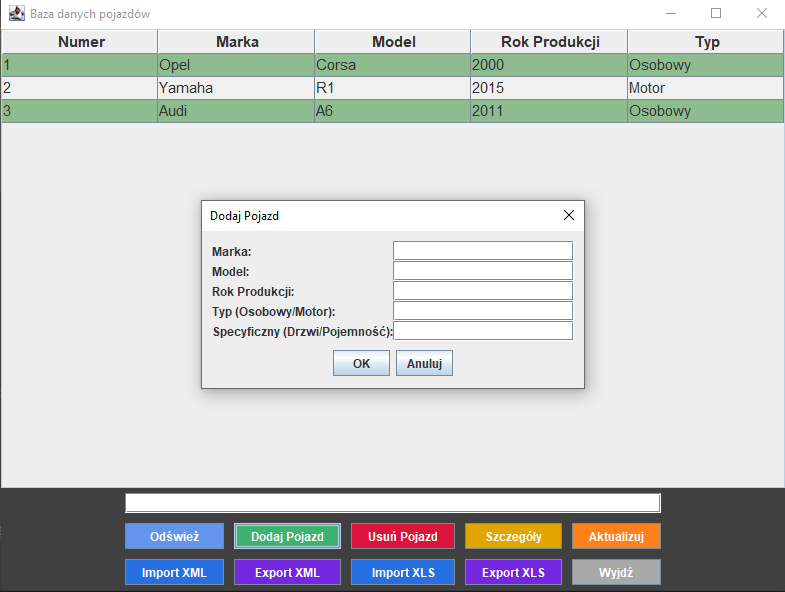

# Vehicle Database – projekt Java

Aplikacja umożliwia zarządzanie bazą pojazdów w relacyjnej bazie danych PostgreSQL. System napisany jest w **Java**. Interfejs pozwala przeglądać, filtrować, dodawać i edytować pojazdy oraz ich szczegóły.

---

## Zawartość projektu

- **Kod źródłowy** – katalog `src`
- **Dokumentacja** – pliki: `Dokumentacja.docx`, `Dokumentacja.pdf`
- **Diagramy** – zobacz poniżej
- **Baza danych** – plik `baza_pojazdow.sql`
- **Pliki graficzne** – podgląd poniżej

---

## Podgląd wybranych ekranów i diagramów

### Diagram systemu

### Diagram Gantta

### Uproszczony diagram

### Ekran główny aplikacji

### Ekran ładowania

### Ekran wczytywania

### Historia commitów

### Formularz dodawania pojazdu

### Formularz importu danych

---

## Pliki projektu

- **`src/`** – kod źródłowy aplikacji
- **`baza_pojazdow.sql`** – definicja i przykładowe dane bazy
- **`Dokumentacja.docx` oraz `Dokumentacja.pdf`** – instrukcja, opis, diagramy
- **`projekt.iml`** – plik konfiguracyjny projektu (IntelliJ)
- **Pozostałe pliki .png** – zrzuty ekranu i diagramy

---

## Instrukcja uruchomienia

1. **Utwórz bazę PostgreSQL**  
   Możesz użyć pliku `baza_pojazdow.sql` do utworzenia struktury i przykładowych danych.

2. **Skonfiguruj połączenie z bazą**  
   Ustaw dane dostępowe w odpowiednim pliku konfiguracyjnym aplikacji (np. w kodzie lub pliku `.properties`).

3. **Zbuduj projekt**  
   Otwórz projekt w IntelliJ IDEA lub innym IDE obsługującym Java/Gradle/Maven.

4. **Uruchom aplikację**  
   W IDE lub przez konsolę.

---

## Główne funkcje

- Przeglądanie, filtrowanie i wyszukiwanie pojazdów
- Dodawanie, edycja, usuwanie pojazdów i szczegółów
- Eksport/import danych (np. do/z pliku)
- Walidacja danych (liczba drzwi, pojemność silnika itp.)
- Obsługa błędów połączenia z bazą

---

## Przykładowa struktura bazy

- Tabela **User** – użytkownicy
- Tabela **Pojazd** – pojazdy
- Tabela **Osobowy** – szczegóły pojazdów osobowych
- Tabela **Motor** – szczegóły motocykli

---

## Autor

- kacperhalaj

---

> Szczegóły implementacji, diagramy oraz instrukcje znajdziesz w pliku `Dokumentacja.pdf` lub `Dokumentacja.docx`.  
> Dokumentacja graficzna – patrz zrzuty ekranu powyżej.
